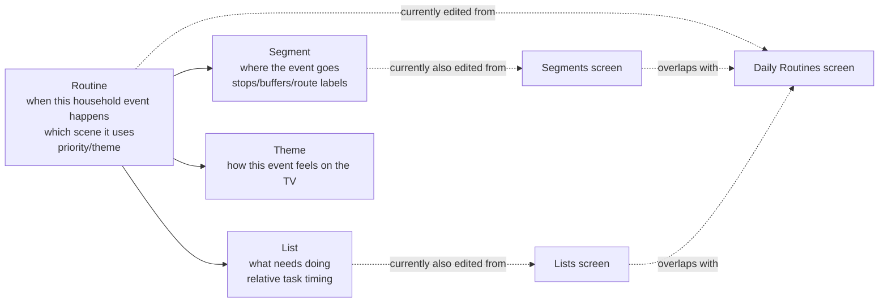
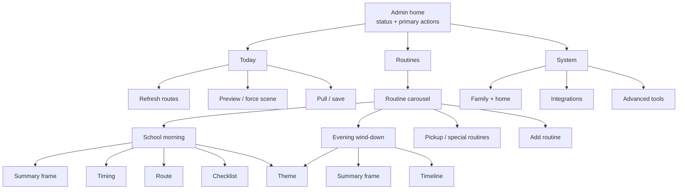
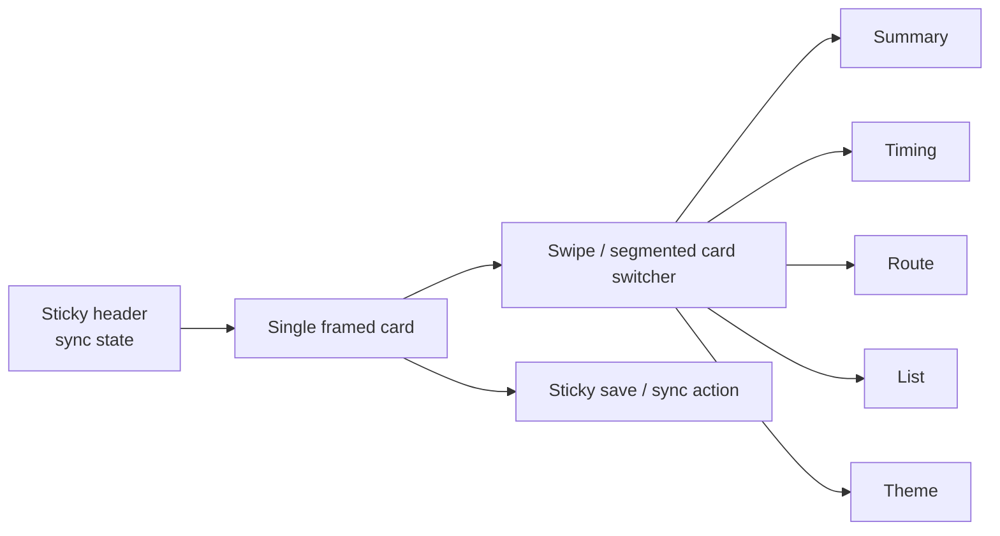

# Admin Flow Map

This map captures the current admin information architecture and a cleaner direction for the next pass. The main tension is that `Routine`, `Segment`, and `List` are currently presented as peer screens even though they are different layers of one household event.

## Current Flow

```mermaid
flowchart TD
  Launch["Admin app"] --> Home["Home menu"]

  Home --> Family["Family"]
  Home --> Daily["Daily Routines"]
  Home --> Segments["Segments"]
  Home --> Lists["Lists"]
  Home --> Integrations["Integrations"]
  Home --> Sync["Sync & Advanced"]

  Family --> Members["Members"]
  Family --> HomeBase["Home base"]
  HomeBase --> Coords["Coordinates"]

  Daily --> GlobalWindows["Global display windows"]
  Daily --> GlobalTheme["Dashboard theme"]
  Daily --> DefaultMorning["Default morning routine"]
  Daily --> RoutineLibrary["Routine library"]
  RoutineLibrary --> RoutineBasics["Routine basics"]
  RoutineLibrary --> RoutineRoute["Route and timing"]
  RoutineLibrary --> RoutineLookup["Local route lookup"]
  RoutineLibrary --> RoutineList["Routine list"]
  RoutineLibrary --> RoutineTimeline["Timeline items"]

  Segments --> SchoolSegment["Default school segment"]
  Segments --> SegmentLookup["Origin / destination"]
  Segments --> EveningSegments["Evening display segments"]
  Segments --> DriveWindows["Fallback drive windows"]

  Lists --> MorningChecklist["Morning checklist"]

  Sync --> RouteRefresh["Refresh all route maps"]
  Sync --> GitHubSync["Pull / save config"]
  Sync --> Diagnostics["GitHub diagnostics"]
  Sync --> RawConfig["Raw config"]
  Sync --> ForceScene["Force scene"]
  Sync --> Feedback["Feedback"]
  Sync --> Danger["Danger zone"]
```



## Where It Feels Conflated



The cleaner model is: **a Routine owns the TV event**. A Segment and a List are supporting parts inside that routine, not equal top-level destinations for most everyday edits.

## Proposed Framed Flow

This direction avoids long scrolls by keeping the user inside a framed card stack. Each card is a primary object, and horizontal movement changes context instead of creating one long vertical form.



## Screen Shape



The goal is not a flashy carousel. The goal is that the phone always feels like it is showing **one thing**: one routine, one aspect, one save path.

## Theme Placement

Theme should stay attached to `routine.display`, because it is part of how that routine appears on the TV.

```json
{
  "display": {
    "scene": "evening",
    "priority": 40,
    "themeId": "ambient-evening"
  }
}
```

Rules:

- Global dashboard theme remains the default.
- A routine can override the global theme.
- Segments never own theme.
- Lists never own theme.
- Sleep/art can continue to derive from the currently active or global theme.

## Recommended Next IA Pass

1. Replace top-level `Daily Routines`, `Segments`, and `Lists` with one top-level `Routines` area.
2. Make each routine a card in a swipeable stack.
3. Inside each routine card, expose framed tabs: Summary, Timing, Route, List/Timeline, Theme.
4. Move global display windows and dashboard default theme to `System`.
5. Keep `Today` focused on operational actions: refresh routes, pull/save, preview current scene.
